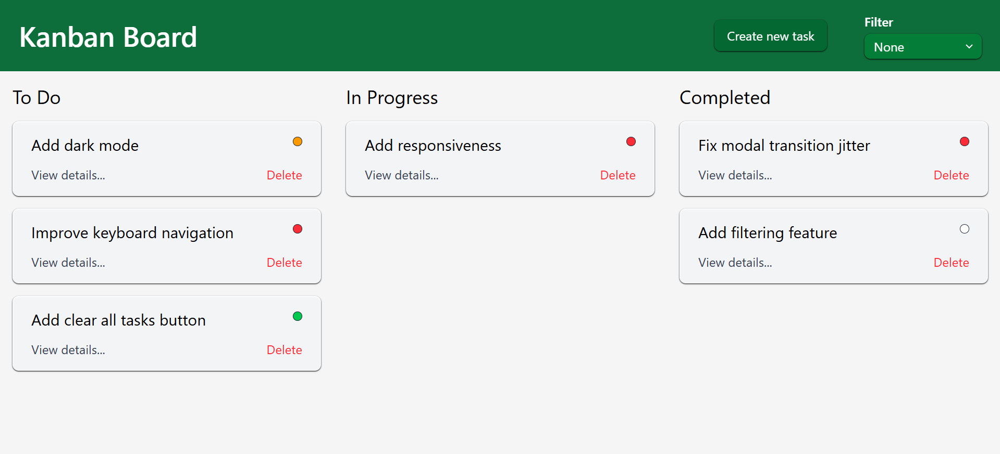

# Recipe Searcher


A simple task tracker. Responsiveness + other features underway. Check out <a href="#future-plans">future plans</a> for more details.

## Table Of Contents
1. [Installation](#installation)
2. [Usage](#usage)
3. [Project Structure](#project-structure)
4. [Tech Stack](#tech-stack)
5. [Author](#author)
6. [License](#license)

## Installation
Copy and paste the commands below into a shell to install and set up the project (change &lt;target-directory&gt; to your actual target folder):
```
cd <target-directory>
git clone https://github.com/logicalPanda2/kanban-board-project.git
cd kanban-board-project
npm install
```

## Usage
Type in `npm run dev` and press `o + Enter` to launch.

## Project Structure
```
/root (kanban-board-project)
    /src
        /components
        /hooks
        /types (TS interfaces and types)
```

## Tech Stack
- React.js
- Tailwind CSS
- TypeScript
- and HTML5, CSS, JS

## Author
Marcelino Romeo @logicalPanda2 (https://github.com/logicalPanda2)

## License
This project is licensed under the <a href="LICENSE.txt">MIT License</a>.